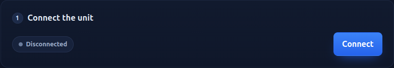
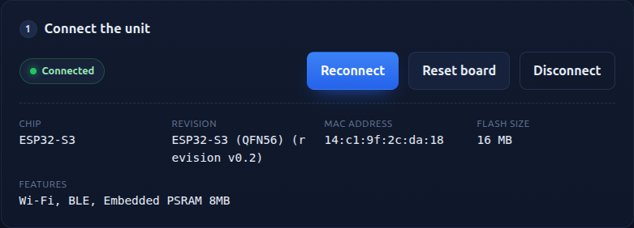
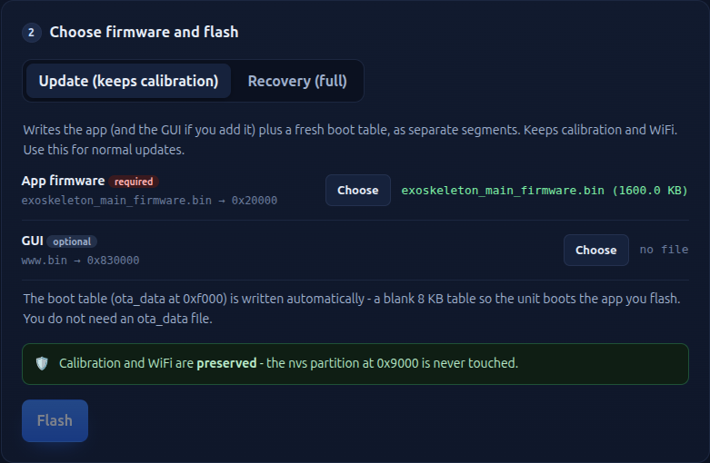
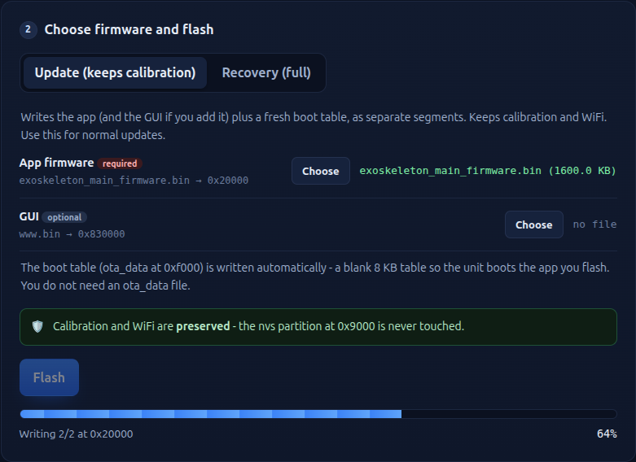
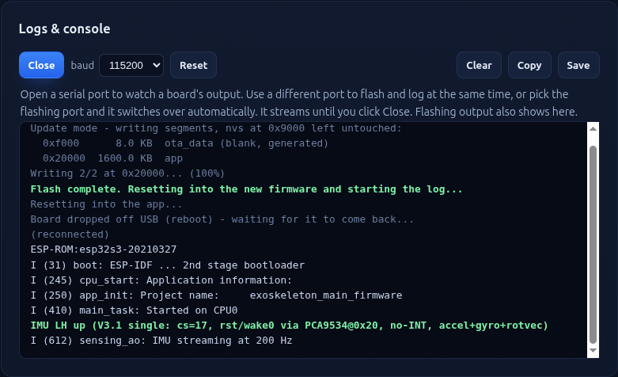

# Exoskeleton Firmware Update Guide

How to update the firmware on an exoskeleton unit from your web browser. It takes about a minute. You do not install anything.

**Update page:** https://osanti22.github.io/exo-flasher/

---

## What you need

- **A supported browser:** Google Chrome or Microsoft Edge on a desktop or laptop (Windows, macOS, or Linux). Safari, iPhone, iPad, and Firefox do not work.
- **A DATA USB cable.** Many cheap cables only charge and carry no data. If the unit never shows up, the cable is the usual cause - try another one.
- **The firmware file we sent you** (`exoskeleton_main_firmware.bin`). Save it somewhere you can find it.

> Your calibration and WiFi settings are kept. The normal update (the default "Update" mode) does not erase them.

---

## Step 1 - Connect the unit

1. Plug the exoskeleton unit into your computer with the USB cable.
2. Open **https://osanti22.github.io/exo-flasher/** in Chrome or Edge.
3. Click **Connect**.

4. A small window pops up asking for the port. Pick the one that looks like **USB JTAG/serial debug unit** (or `USB Serial` / `ttyACM` / `COM`) and click **Connect**.

When it connects, the page shows the unit's details (chip, MAC address, flash size). This is how you know it is talking to the unit.

---

## Step 2 - Choose the firmware file

Keep the mode on **Update (keeps calibration)** - this is the default and the one you want.

Next to **App firmware**, click **Choose** and select the `exoskeleton_main_firmware.bin` file we sent you. The file name appears in green.

The green box confirms your calibration and WiFi are kept. You do not need any other file.

---

## Step 3 - Flash

Click **Flash** and wait. A progress bar fills up as it writes. Do not unplug the unit while it runs.

---

## Step 4 - Confirm it worked

When it finishes, the unit restarts on its own and the **Logs and console** panel starts showing the boot messages. You do not need to press anything.

Look for the line **`IMU LH up`** (shown in green). That line means the update worked and the unit booted correctly.

That is it. You can unplug the unit.

---

## If something goes wrong

- **The unit does not appear in the pop-up.** Use a different USB cable (a data cable) and a different USB port, then click Connect again.
- **The log does not show anything after the update.** Click **Reconnect monitor** in the Logs panel, or unplug and replug the unit.
- **"Connect failed".** Close any other program that might be using the port, then try Connect again.
- **Save the log for us.** If you need help, click **Save** in the Logs panel and send us the file.

---

## Note on "Recovery" mode

The page also has a **Recovery (full)** mode. **Do not use it** unless we ask you to. Recovery erases the unit's calibration and WiFi settings and is only for a unit that will not start at all. For a normal update, always use **Update**.
